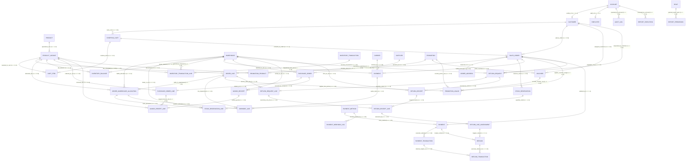

```mermaid
erDiagram
    %% =========================================================================
    %% 1. HUB: PRODUCT CATALOG & CORE SKU
    %% =========================================================================
    PRODUCT ||--|{ PRODUCT_VARIANT : "specializes_into (1..1 : 1..N)"
    
    %% =========================================================================
    %% 2. HUB: CUSTOMER & IDENTITY (TPT SUBTYPE INHERITANCE)
    %% =========================================================================
    ACCOUNT ||--o| CUSTOMER : "profile_of (1..1 : 0..1)"
    ACCOUNT ||--o| EMPLOYEE : "staff_of (1..1 : 0..1)"
    
    %% =========================================================================
    %% 3. CROSS-DOMAIN: SHOPPING & CART
    %% =========================================================================
    CUSTOMER ||--o{ SHOPPING_CART : "owns_cart (1..1 : 0..N)"
    SHOPPING_CART ||--o{ CART_ITEM : "contains_items (1..1 : 0..N)"
    PRODUCT_VARIANT ||--o{ CART_ITEM : "selected_in_cart (1..1 : 0..N)"
    
    %% =========================================================================
    %% 4. CROSS-DOMAIN: SALES CONVERSION & SNAPSHOT
    %% =========================================================================
    CUSTOMER ||--o{ SALES_ORDER : "places_order (1..1 : 0..N)"
    SHOPPING_CART ||--o| SALES_ORDER : "converts_to_order (1..1 : 0..1)"
    SALES_ORDER ||--|{ ORDER_LINE : "composed_of (1..1 : 1..N)"
    PRODUCT_VARIANT ||--o{ ORDER_LINE : "sold_as_sku (1..1 : 0..N)"
    SALES_ORDER ||--|| ORDER_ADDRESS : "delivered_to (1..1 : 1..1)"
    
    %% =========================================================================
    %% 5. CROSS-DOMAIN: WAREHOUSE ALLOCATION & RESERVATION (SPLIT SHIPMENT)
    %% =========================================================================
    ORDER_LINE ||--|{ ORDER_WAREHOUSE_ALLOCATION : "splits_to_warehouse (1..1 : 1..N)"
    WAREHOUSE ||--o{ ORDER_WAREHOUSE_ALLOCATION : "fulfills_allocation (1..1 : 0..N)"
    PRODUCT_VARIANT ||--o{ ORDER_WAREHOUSE_ALLOCATION : "allocated_sku (1..1 : 0..N)"
    
    SALES_ORDER ||--o{ STOCK_RESERVATION : "reserves_stock (1..1 : 0..N)"
    STOCK_RESERVATION ||--|{ STOCK_RESERVATION_LINE : "specifies_hold (1..1 : 1..N)"
    ORDER_WAREHOUSE_ALLOCATION ||--o{ STOCK_RESERVATION_LINE : "locks_allocation (1..1 : 0..N)"
    WAREHOUSE ||--o{ STOCK_RESERVATION_LINE : "holds_in_wh (1..1 : 0..N)"
    
    %% Tồn kho vật lý tức thời
    WAREHOUSE ||--o{ INVENTORY_BALANCE : "stores_balance (1..1 : 0..N)"
    PRODUCT_VARIANT ||--o{ INVENTORY_BALANCE : "sku_balance (1..1 : 0..N)"
    
    %% Sổ cái biến động kho
    INVENTORY_TRANSACTION ||--|{ INVENTORY_TRANSACTION_LINE : "records_movement (1..1 : 1..N)"
    WAREHOUSE ||--o{ INVENTORY_TRANSACTION_LINE : "warehouse_impacted (1..1 : 0..N)"
    PRODUCT_VARIANT ||--o{ INVENTORY_TRANSACTION_LINE : "sku_impacted (1..1 : 0..N)"
    
    %% =========================================================================
    %% 6. CROSS-DOMAIN: FULFILLMENT & SHIPPING
    %% =========================================================================
    SALES_ORDER ||--o{ SHIPMENT : "fulfilled_through (1..1 : 0..N)"
    WAREHOUSE ||--o{ SHIPMENT : "dispatched_from_wh (1..1 : 0..N)"
    CARRIER ||--o{ SHIPMENT : "carried_by (1..1 : 0..N)"
    SHIPMENT ||--|{ SHIPMENT_LINE : "packs_items (1..1 : 1..N)"
    ORDER_LINE ||--o{ SHIPMENT_LINE : "line_dispatched (1..1 : 0..N)"
    ORDER_WAREHOUSE_ALLOCATION ||--o{ SHIPMENT_LINE : "realizes_allocation (1..1 : 0..N)"
    
    %% =========================================================================
    %% 7. CROSS-DOMAIN: PROCUREMENT & GOODS INWARD
    %% =========================================================================
    SUPPLIER ||--o{ PURCHASE_ORDER : "receives_po (1..1 : 0..N)"
    WAREHOUSE ||--o{ PURCHASE_ORDER : "destined_to_wh (1..1 : 0..N)"
    PURCHASE_ORDER ||--|{ PURCHASE_ORDER_LINE : "details_po (1..1 : 1..N)"
    PRODUCT_VARIANT ||--o{ PURCHASE_ORDER_LINE : "ordered_po_sku (1..1 : 0..N)"
    
    PURCHASE_ORDER ||--o{ GOODS_RECEIPT : "received_by_receipt (1..1 : 0..N)"
    WAREHOUSE ||--o{ GOODS_RECEIPT : "receipt_at_wh (1..1 : 0..N)"
    GOODS_RECEIPT ||--|{ GOODS_RECEIPT_LINE : "verifies_goods (1..1 : 1..N)"
    PURCHASE_ORDER_LINE ||--o{ GOODS_RECEIPT_LINE : "inward_from_po_line (1..1 : 0..N)"
    PRODUCT_VARIANT ||--o{ GOODS_RECEIPT_LINE : "received_sku (1..1 : 0..N)"
    
    %% =========================================================================
    %% 8. CROSS-DOMAIN: PROMOTIONS & VOUCHERS
    %% =========================================================================
    PROMOTION ||--o{ PROMOTION_PRODUCT : "includes_skus (1..1 : 0..N)"
    PRODUCT_VARIANT ||--o{ PROMOTION_PRODUCT : "discounted_in (1..1 : 0..N)"
    
    PROMOTION ||--o{ VOUCHER : "emits_voucher (1..1 : 0..N)"
    CUSTOMER ||--o{ VOUCHER : "assigned_customer (0..1 : 0..N)"
    
    SALES_ORDER ||--o{ PROMOTION_USAGE : "applies_voucher_usage (1..1 : 0..N)"
    ORDER_LINE ||--o{ PROMOTION_USAGE : "applies_line_promo (1..1 : 0..N)"
    PROMOTION ||--o{ PROMOTION_USAGE : "records_promo_use (1..1 : 0..N)"
    VOUCHER ||--o{ PROMOTION_USAGE : "records_voucher_use (1..1 : 0..N)"
    
    %% =========================================================================
    %% 9. CROSS-DOMAIN: PAYMENT & FINANCIAL SETTLEMENT
    %% =========================================================================
    SALES_ORDER ||--|| PAYMENT : "settled_by (1..1 : 1..1)"
    PAYMENT_METHOD ||--o{ PAYMENT : "uses_method (1..1 : 0..N)"
    PAYMENT_METHOD ||--o{ PAYMENT_WEBHOOK_LOG : "receives_webhook (1..1 : 0..N)"
    PAYMENT ||--o{ PAYMENT_TRANSACTION : "executes_attempts (1..1 : 0..N)"
    PAYMENT ||--o{ REFUND : "creates_refund (1..1 : 0..N)"
    REFUND ||--o{ REFUND_TRANSACTION : "executes_refund_tx (1..1 : 0..N)"
    PAYMENT_TRANSACTION ||--o{ REFUND_TRANSACTION : "refunds_original_tx (1..1 : 0..N)"
    
    %% =========================================================================
    %% 10. CROSS-DOMAIN: RETURN & EXCHANGE (RMA)
    %% =========================================================================
    SALES_ORDER ||--o{ RETURN_REQUEST : "originates_rma (1..1 : 0..N)"
    CUSTOMER ||--o{ RETURN_REQUEST : "requested_by_customer (1..1 : 0..N)"
    WAREHOUSE ||--o{ RETURN_REQUEST : "returned_to_warehouse (1..1 : 0..N)"
    RETURN_REQUEST ||--|{ RETURN_REQUEST_LINE : "specifies_return (1..1 : 1..N)"
    ORDER_LINE ||--o{ RETURN_REQUEST_LINE : "returns_order_line (1..1 : 0..N)"
    
    RETURN_REQUEST ||--o{ RETURN_RECEIPT : "received_by_dock (1..1 : 0..N)"
    WAREHOUSE ||--o{ RETURN_RECEIPT : "dock_at_wh (1..1 : 0..N)"
    RETURN_RECEIPT ||--|{ RETURN_RECEIPT_LINE : "inspects_items (1..1 : 1..N)"
    RETURN_REQUEST_LINE ||--o{ RETURN_RECEIPT_LINE : "reconciles_rma_line (1..1 : 0..N)"
    
    RETURN_RECEIPT_LINE ||--|{ RETURN_LINE_ASSESSMENT : "assessed_by (1..1 : 1..N)"
    RETURN_LINE_ASSESSMENT ||--o| REFUND : "triggers_refund (1..1 : 0..1)"
    
    %% =========================================================================
    %% 11. CROSS-DOMAIN: AUDIT & REPORTING GOVERNANCE
    %% =========================================================================
    ACCOUNT ||--o{ AUDIT_LOG : "operated_by_account (0..1 : 0..N)"
    ACCOUNT ||--o{ REPORT_EXECUTION : "executed_by_account (1..1 : 0..N)"
    ROLE ||--o{ REPORT_PERMISSION : "granted_report_perm (1..1 : 0..N)"
```
