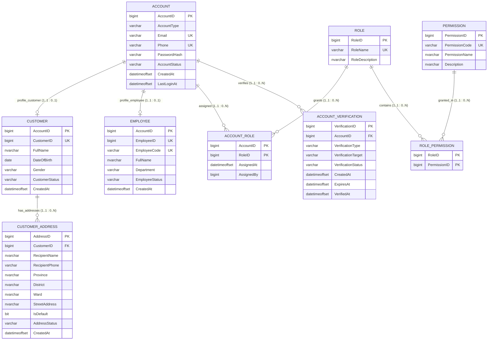

```mermaid
erDiagram
    ACCOUNT ||--o| CUSTOMER : "profile_customer (1..1 : 0..1)"
    ACCOUNT ||--o| EMPLOYEE : "profile_employee (1..1 : 0..1)"

    CUSTOMER ||--o{ CUSTOMER_ADDRESS : "has_addresses (1..1 : 0..N)"

    ACCOUNT ||--o{ ACCOUNT_ROLE : "assigned (1..1 : 0..N)"
    ROLE ||--o{ ACCOUNT_ROLE : "grants (1..1 : 0..N)"

    ROLE ||--o{ ROLE_PERMISSION : "contains (1..1 : 0..N)"
    PERMISSION ||--o{ ROLE_PERMISSION : "granted_in (1..1 : 0..N)"

    ACCOUNT ||--o{ ACCOUNT_VERIFICATION : "verifies (1..1 : 0..N)"

    ACCOUNT {
        bigint AccountID PK
        varchar AccountType
        varchar Email UK
        varchar Phone UK
        varchar PasswordHash
        varchar AccountStatus
        datetimeoffset CreatedAt
        datetimeoffset LastLoginAt
    }
    CUSTOMER {
        bigint AccountID PK
        bigint CustomerID UK
        nvarchar FullName
        date DateOfBirth
        varchar Gender
        varchar CustomerStatus
        datetimeoffset CreatedAt
    }
    EMPLOYEE {
        bigint AccountID PK
        bigint EmployeeID UK
        varchar EmployeeCode UK
        nvarchar FullName
        varchar Department
        varchar EmployeeStatus
        datetimeoffset CreatedAt
    }
    ROLE {
        bigint RoleID PK
        varchar RoleName UK
        nvarchar RoleDescription
    }
    PERMISSION {
        bigint PermissionID PK
        varchar PermissionCode UK
        nvarchar PermissionName
        nvarchar Description
    }
    ACCOUNT_ROLE {
        bigint AccountID PK
        bigint RoleID PK
        datetimeoffset AssignedAt
        bigint AssignedBy
    }
    ROLE_PERMISSION {
        bigint RoleID PK
        bigint PermissionID PK
    }
    CUSTOMER_ADDRESS {
        bigint AddressID PK
        bigint CustomerID FK
        nvarchar RecipientName
        varchar RecipientPhone
        nvarchar Province
        nvarchar District
        nvarchar Ward
        nvarchar StreetAddress
        bit IsDefault
        varchar AddressStatus
        datetimeoffset CreatedAt
    }
    ACCOUNT_VERIFICATION {
        bigint VerificationID PK
        bigint AccountID FK
        varchar VerificationType
        varchar VerificationTarget
        varchar VerificationStatus
        datetimeoffset CreatedAt
        datetimeoffset ExpiresAt
        datetimeoffset VerifiedAt
    }
```
