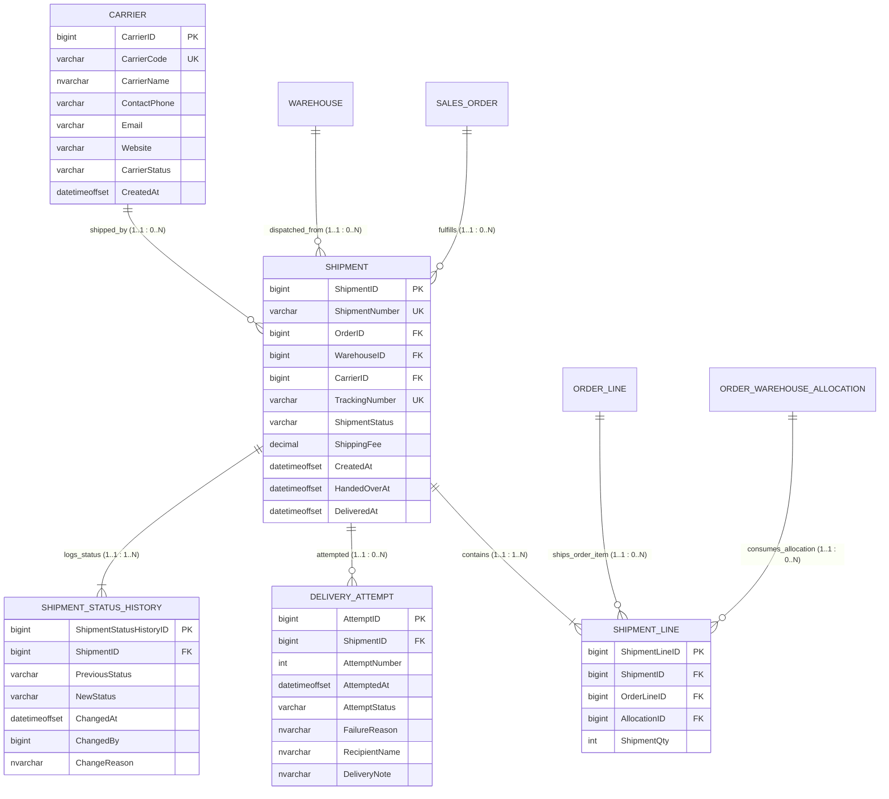

```mermaid
erDiagram
    SALES_ORDER ||--o{ SHIPMENT : "fulfills (1..1 : 0..N)"
    WAREHOUSE ||--o{ SHIPMENT : "dispatched_from (1..1 : 0..N)"
    CARRIER ||--o{ SHIPMENT : "shipped_by (1..1 : 0..N)"

    SHIPMENT ||--|{ SHIPMENT_LINE : "contains (1..1 : 1..N)"
    ORDER_LINE ||--o{ SHIPMENT_LINE : "ships_order_item (1..1 : 0..N)"
    ORDER_WAREHOUSE_ALLOCATION ||--o{ SHIPMENT_LINE : "consumes_allocation (1..1 : 0..N)"

    SHIPMENT ||--o{ DELIVERY_ATTEMPT : "attempted (1..1 : 0..N)"
    SHIPMENT ||--|{ SHIPMENT_STATUS_HISTORY : "logs_status (1..1 : 1..N)"

    CARRIER {
        bigint CarrierID PK
        varchar CarrierCode UK
        nvarchar CarrierName
        varchar ContactPhone
        varchar Email
        varchar Website
        varchar CarrierStatus
        datetimeoffset CreatedAt
    }
    SHIPMENT {
        bigint ShipmentID PK
        varchar ShipmentNumber UK
        bigint OrderID FK
        bigint WarehouseID FK
        bigint CarrierID FK
        varchar TrackingNumber UK
        varchar ShipmentStatus
        decimal ShippingFee
        datetimeoffset CreatedAt
        datetimeoffset HandedOverAt
        datetimeoffset DeliveredAt
    }
    SHIPMENT_LINE {
        bigint ShipmentLineID PK
        bigint ShipmentID FK
        bigint OrderLineID FK
        bigint AllocationID FK
        int ShipmentQty
    }
    DELIVERY_ATTEMPT {
        bigint AttemptID PK
        bigint ShipmentID FK
        int AttemptNumber
        datetimeoffset AttemptedAt
        varchar AttemptStatus
        nvarchar FailureReason
        nvarchar RecipientName
        nvarchar DeliveryNote
    }
    SHIPMENT_STATUS_HISTORY {
        bigint ShipmentStatusHistoryID PK
        bigint ShipmentID FK
        varchar PreviousStatus
        varchar NewStatus
        datetimeoffset ChangedAt
        bigint ChangedBy
        nvarchar ChangeReason
    }
```