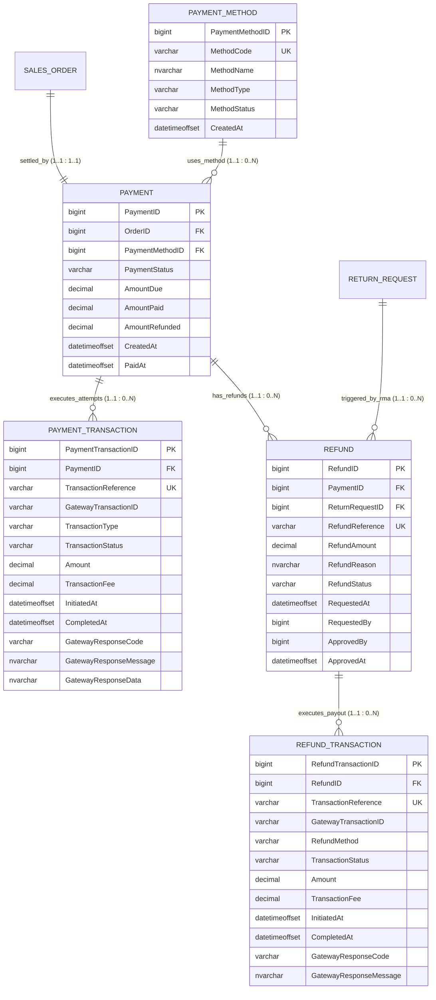

```mermaid
erDiagram
    SALES_ORDER ||--|| PAYMENT : "settled_by (1..1 : 1..1)"
    PAYMENT_METHOD ||--o{ PAYMENT : "uses_method (1..1 : 0..N)"

    PAYMENT ||--o{ PAYMENT_TRANSACTION : "executes_attempts (1..1 : 0..N)"
    PAYMENT ||--o{ REFUND : "has_refunds (1..1 : 0..N)"
    RETURN_REQUEST ||--o{ REFUND : "triggered_by_rma (1..1 : 0..N)"
    REFUND ||--o{ REFUND_TRANSACTION : "executes_payout (1..1 : 0..N)"

    PAYMENT_METHOD {
        bigint PaymentMethodID PK
        varchar MethodCode UK
        nvarchar MethodName
        varchar MethodType
        varchar MethodStatus
        datetimeoffset CreatedAt
    }
    PAYMENT {
        bigint PaymentID PK
        bigint OrderID FK
        bigint PaymentMethodID FK
        varchar PaymentStatus
        decimal AmountDue
        decimal AmountPaid
        decimal AmountRefunded
        datetimeoffset CreatedAt
        datetimeoffset PaidAt
    }
    PAYMENT_TRANSACTION {
        bigint PaymentTransactionID PK
        bigint PaymentID FK
        varchar TransactionReference UK
        varchar GatewayTransactionID
        varchar TransactionType
        varchar TransactionStatus
        decimal Amount
        decimal TransactionFee
        datetimeoffset InitiatedAt
        datetimeoffset CompletedAt
        varchar GatewayResponseCode
        nvarchar GatewayResponseMessage
        nvarchar GatewayResponseData
    }
    REFUND {
        bigint RefundID PK
        bigint PaymentID FK
        bigint ReturnRequestID FK
        varchar RefundReference UK
        decimal RefundAmount
        nvarchar RefundReason
        varchar RefundStatus
        datetimeoffset RequestedAt
        bigint RequestedBy
        bigint ApprovedBy
        datetimeoffset ApprovedAt
    }
    REFUND_TRANSACTION {
        bigint RefundTransactionID PK
        bigint RefundID FK
        varchar TransactionReference UK
        varchar GatewayTransactionID
        varchar RefundMethod
        varchar TransactionStatus
        decimal Amount
        decimal TransactionFee
        datetimeoffset InitiatedAt
        datetimeoffset CompletedAt
        varchar GatewayResponseCode
        nvarchar GatewayResponseMessage
    }
```