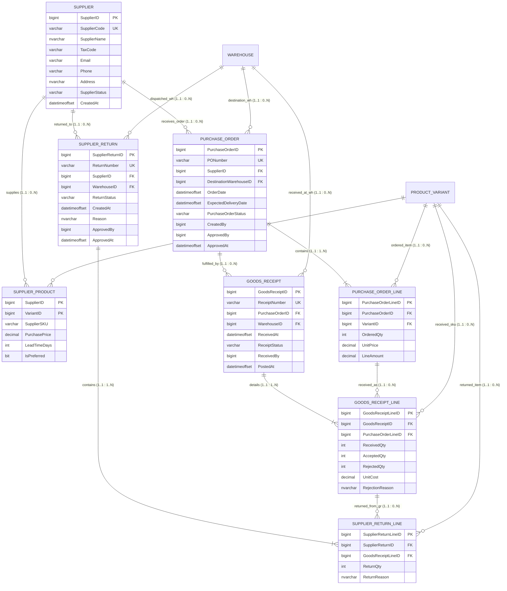

```mermaid
erDiagram
    SUPPLIER ||--o{ SUPPLIER_PRODUCT : "supplies (1..1 : 0..N)"
    PRODUCT_VARIANT ||--o{ SUPPLIER_PRODUCT : "sourced_from (1..1 : 0..N)"

    SUPPLIER ||--o{ PURCHASE_ORDER : "receives_order (1..1 : 0..N)"
    WAREHOUSE ||--o{ PURCHASE_ORDER : "destination_wh (1..1 : 0..N)"
    PURCHASE_ORDER ||--|{ PURCHASE_ORDER_LINE : "contains (1..1 : 1..N)"
    PRODUCT_VARIANT ||--o{ PURCHASE_ORDER_LINE : "ordered_item (1..1 : 0..N)"

    PURCHASE_ORDER ||--o{ GOODS_RECEIPT : "fulfilled_by (1..1 : 0..N)"
    WAREHOUSE ||--o{ GOODS_RECEIPT : "received_at_wh (1..1 : 0..N)"
    GOODS_RECEIPT ||--|{ GOODS_RECEIPT_LINE : "details (1..1 : 1..N)"
    PURCHASE_ORDER_LINE ||--o{ GOODS_RECEIPT_LINE : "received_as (1..1 : 0..N)"
    PRODUCT_VARIANT ||--o{ GOODS_RECEIPT_LINE : "received_sku (1..1 : 0..N)"

    SUPPLIER ||--o{ SUPPLIER_RETURN : "returned_to (1..1 : 0..N)"
    WAREHOUSE ||--o{ SUPPLIER_RETURN : "dispatched_wh (1..1 : 0..N)"
    SUPPLIER_RETURN ||--|{ SUPPLIER_RETURN_LINE : "contains (1..1 : 1..N)"
    GOODS_RECEIPT_LINE ||--o{ SUPPLIER_RETURN_LINE : "returned_from_gr (1..1 : 0..N)"
    PRODUCT_VARIANT ||--o{ SUPPLIER_RETURN_LINE : "returned_item (1..1 : 0..N)"

    SUPPLIER {
        bigint SupplierID PK
        varchar SupplierCode UK
        nvarchar SupplierName
        varchar TaxCode
        varchar Email
        varchar Phone
        nvarchar Address
        varchar SupplierStatus
        datetimeoffset CreatedAt
    }
    SUPPLIER_PRODUCT {
        bigint SupplierID PK
        bigint VariantID PK
        varchar SupplierSKU
        decimal PurchasePrice
        int LeadTimeDays
        bit IsPreferred
    }
    PURCHASE_ORDER {
        bigint PurchaseOrderID PK
        varchar PONumber UK
        bigint SupplierID FK
        bigint DestinationWarehouseID FK
        datetimeoffset OrderDate
        datetimeoffset ExpectedDeliveryDate
        varchar PurchaseOrderStatus
        bigint CreatedBy
        bigint ApprovedBy
        datetimeoffset ApprovedAt
    }
    PURCHASE_ORDER_LINE {
        bigint PurchaseOrderLineID PK
        bigint PurchaseOrderID FK
        bigint VariantID FK
        int OrderedQty
        decimal UnitPrice
        decimal LineAmount
    }
    GOODS_RECEIPT {
        bigint GoodsReceiptID PK
        varchar ReceiptNumber UK
        bigint PurchaseOrderID FK
        bigint WarehouseID FK
        datetimeoffset ReceivedAt
        varchar ReceiptStatus
        bigint ReceivedBy
        datetimeoffset PostedAt
    }
    GOODS_RECEIPT_LINE {
        bigint GoodsReceiptLineID PK
        bigint GoodsReceiptID FK
        bigint PurchaseOrderLineID FK
        int ReceivedQty
        int AcceptedQty
        int RejectedQty
        decimal UnitCost
        nvarchar RejectionReason
    }
    SUPPLIER_RETURN {
        bigint SupplierReturnID PK
        varchar ReturnNumber UK
        bigint SupplierID FK
        bigint WarehouseID FK
        varchar ReturnStatus
        datetimeoffset CreatedAt
        nvarchar Reason
        bigint ApprovedBy
        datetimeoffset ApprovedAt
    }
    SUPPLIER_RETURN_LINE {
        bigint SupplierReturnLineID PK
        bigint SupplierReturnID FK
        bigint GoodsReceiptLineID FK
        int ReturnQty
        nvarchar ReturnReason
    }
```