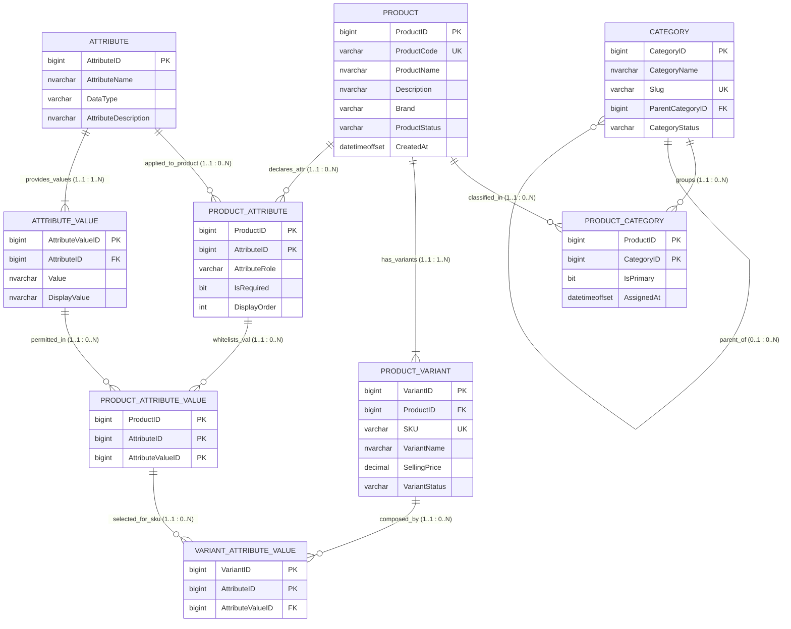

```mermaid
erDiagram
    PRODUCT ||--o{ PRODUCT_CATEGORY : "classified_in (1..1 : 0..N)"
    CATEGORY ||--o{ PRODUCT_CATEGORY : "groups (1..1 : 0..N)"
    CATEGORY ||--o{ CATEGORY : "parent_of (0..1 : 0..N)"

    PRODUCT ||--|{ PRODUCT_VARIANT : "has_variants (1..1 : 1..N)"

    PRODUCT ||--o{ PRODUCT_ATTRIBUTE : "declares_attr (1..1 : 0..N)"
    ATTRIBUTE ||--o{ PRODUCT_ATTRIBUTE : "applied_to_product (1..1 : 0..N)"

    ATTRIBUTE ||--|{ ATTRIBUTE_VALUE : "provides_values (1..1 : 1..N)"

    PRODUCT_ATTRIBUTE ||--o{ PRODUCT_ATTRIBUTE_VALUE : "whitelists_val (1..1 : 0..N)"
    ATTRIBUTE_VALUE ||--o{ PRODUCT_ATTRIBUTE_VALUE : "permitted_in (1..1 : 0..N)"

    PRODUCT_VARIANT ||--o{ VARIANT_ATTRIBUTE_VALUE : "composed_by (1..1 : 0..N)"
    PRODUCT_ATTRIBUTE_VALUE ||--o{ VARIANT_ATTRIBUTE_VALUE : "selected_for_sku (1..1 : 0..N)"

    PRODUCT {
        bigint ProductID PK
        varchar ProductCode UK
        nvarchar ProductName
        nvarchar Description
        varchar Brand
        varchar ProductStatus
        datetimeoffset CreatedAt
    }
    CATEGORY {
        bigint CategoryID PK
        nvarchar CategoryName
        varchar Slug UK
        bigint ParentCategoryID FK
        varchar CategoryStatus
    }
    PRODUCT_CATEGORY {
        bigint ProductID PK
        bigint CategoryID PK
        bit IsPrimary
        datetimeoffset AssignedAt
    }
    PRODUCT_VARIANT {
        bigint VariantID PK
        bigint ProductID FK
        varchar SKU UK
        nvarchar VariantName
        decimal SellingPrice
        varchar VariantStatus
    }
    ATTRIBUTE {
        bigint AttributeID PK
        nvarchar AttributeName
        varchar DataType
        nvarchar AttributeDescription
    }
    ATTRIBUTE_VALUE {
        bigint AttributeValueID PK
        bigint AttributeID FK
        nvarchar Value
        nvarchar DisplayValue
    }
    PRODUCT_ATTRIBUTE {
        bigint ProductID PK
        bigint AttributeID PK
        varchar AttributeRole
        bit IsRequired
        int DisplayOrder
    }
    PRODUCT_ATTRIBUTE_VALUE {
        bigint ProductID PK
        bigint AttributeID PK
        bigint AttributeValueID PK
    }
    VARIANT_ATTRIBUTE_VALUE {
        bigint VariantID PK
        bigint AttributeID PK
        bigint AttributeValueID FK
    }
```