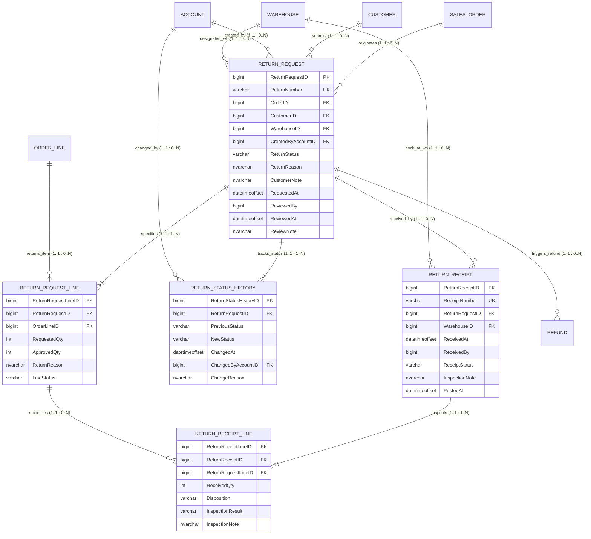

```mermaid
erDiagram
    SALES_ORDER ||--o{ RETURN_REQUEST : "originates (1..1 : 0..N)"
    CUSTOMER ||--o{ RETURN_REQUEST : "submits (1..1 : 0..N)"
    ACCOUNT ||--o{ RETURN_REQUEST : "created_by (1..1 : 0..N)"
    WAREHOUSE ||--o{ RETURN_REQUEST : "designated_wh (1..1 : 0..N)"

    RETURN_REQUEST ||--|{ RETURN_REQUEST_LINE : "specifies (1..1 : 1..N)"
    ORDER_LINE ||--o{ RETURN_REQUEST_LINE : "returns_item (1..1 : 0..N)"

    RETURN_REQUEST ||--|{ RETURN_STATUS_HISTORY : "tracks_status (1..1 : 1..N)"
    ACCOUNT ||--o{ RETURN_STATUS_HISTORY : "changed_by (1..1 : 0..N)"

    RETURN_REQUEST ||--o{ RETURN_RECEIPT : "received_by (1..1 : 0..N)"
    WAREHOUSE ||--o{ RETURN_RECEIPT : "dock_at_wh (1..1 : 0..N)"
    RETURN_RECEIPT ||--|{ RETURN_RECEIPT_LINE : "inspects (1..1 : 1..N)"
    RETURN_REQUEST_LINE ||--o{ RETURN_RECEIPT_LINE : "reconciles (1..1 : 0..N)"

    RETURN_REQUEST ||--o{ REFUND : "triggers_refund (1..1 : 0..N)"

    RETURN_REQUEST {
        bigint ReturnRequestID PK
        varchar ReturnNumber UK
        bigint OrderID FK
        bigint CustomerID FK
        bigint WarehouseID FK
        bigint CreatedByAccountID FK
        varchar ReturnStatus
        nvarchar ReturnReason
        nvarchar CustomerNote
        datetimeoffset RequestedAt
        bigint ReviewedBy
        datetimeoffset ReviewedAt
        nvarchar ReviewNote
    }
    RETURN_REQUEST_LINE {
        bigint ReturnRequestLineID PK
        bigint ReturnRequestID FK
        bigint OrderLineID FK
        int RequestedQty
        int ApprovedQty
        nvarchar ReturnReason
        varchar LineStatus
    }
    RETURN_RECEIPT {
        bigint ReturnReceiptID PK
        varchar ReceiptNumber UK
        bigint ReturnRequestID FK
        bigint WarehouseID FK
        datetimeoffset ReceivedAt
        bigint ReceivedBy
        varchar ReceiptStatus
        nvarchar InspectionNote
        datetimeoffset PostedAt
    }
    RETURN_RECEIPT_LINE {
        bigint ReturnReceiptLineID PK
        bigint ReturnReceiptID FK
        bigint ReturnRequestLineID FK
        int ReceivedQty
        varchar Disposition
        varchar InspectionResult
        nvarchar InspectionNote
    }
    RETURN_STATUS_HISTORY {
        bigint ReturnStatusHistoryID PK
        bigint ReturnRequestID FK
        varchar PreviousStatus
        varchar NewStatus
        datetimeoffset ChangedAt
        bigint ChangedByAccountID FK
        nvarchar ChangeReason
    }
```