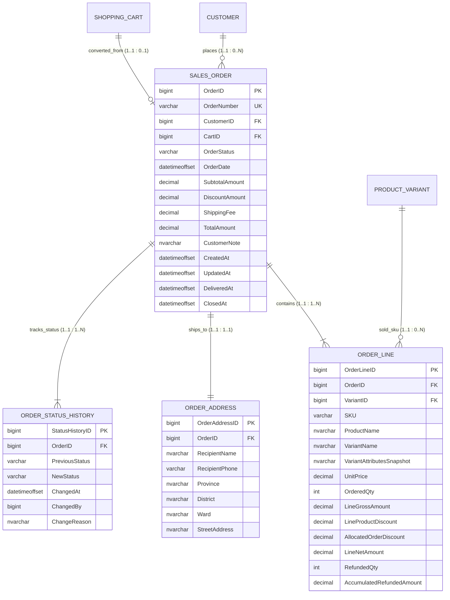

```mermaid
erDiagram
    CUSTOMER ||--o{ SALES_ORDER : "places (1..1 : 0..N)"
    SHOPPING_CART ||--o| SALES_ORDER : "converted_from (1..1 : 0..1)"

    SALES_ORDER ||--|{ ORDER_LINE : "contains (1..1 : 1..N)"
    PRODUCT_VARIANT ||--o{ ORDER_LINE : "sold_sku (1..1 : 0..N)"

    SALES_ORDER ||--|| ORDER_ADDRESS : "ships_to (1..1 : 1..1)"
    SALES_ORDER ||--|{ ORDER_STATUS_HISTORY : "tracks_status (1..1 : 1..N)"

    SALES_ORDER {
        bigint OrderID PK
        varchar OrderNumber UK
        bigint CustomerID FK
        bigint CartID FK
        varchar OrderStatus
        datetimeoffset OrderDate
        decimal SubtotalAmount
        decimal DiscountAmount
        decimal ShippingFee
        decimal TotalAmount
        nvarchar CustomerNote
        datetimeoffset CreatedAt
        datetimeoffset UpdatedAt
        datetimeoffset DeliveredAt
        datetimeoffset ClosedAt
    }
    ORDER_LINE {
        bigint OrderLineID PK
        bigint OrderID FK
        bigint VariantID FK
        varchar SKU
        nvarchar ProductName
        nvarchar VariantName
        nvarchar VariantAttributesSnapshot
        decimal UnitPrice
        int OrderedQty
        decimal LineGrossAmount
        decimal LineProductDiscount
        decimal AllocatedOrderDiscount
        decimal LineNetAmount
        int RefundedQty
        decimal AccumulatedRefundedAmount
    }
    ORDER_ADDRESS {
        bigint OrderAddressID PK
        bigint OrderID FK
        nvarchar RecipientName
        varchar RecipientPhone
        nvarchar Province
        nvarchar District
        nvarchar Ward
        nvarchar StreetAddress
    }
    ORDER_STATUS_HISTORY {
        bigint StatusHistoryID PK
        bigint OrderID FK
        varchar PreviousStatus
        varchar NewStatus
        datetimeoffset ChangedAt
        bigint ChangedBy
        nvarchar ChangeReason
    }
```
