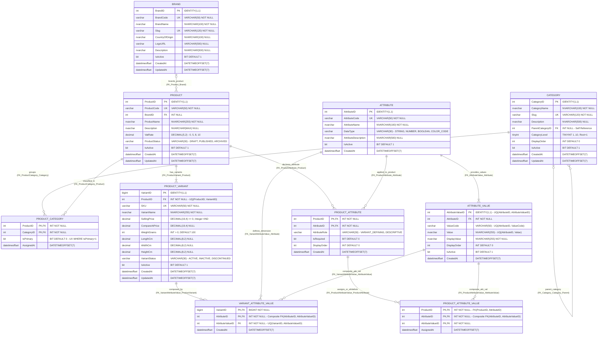

```mermaid
erDiagram
    BRAND |o--o{ PRODUCT : "brands_product (FK_Product_Brand)"
    CATEGORY |o--o{ CATEGORY : "parent_category (FK_Category_Category_Parent)"
    CATEGORY ||--o{ PRODUCT_CATEGORY : "groups (FK_ProductCategory_Category)"
    PRODUCT ||--o{ PRODUCT_CATEGORY : "classified_in (FK_ProductCategory_Product)"
    PRODUCT ||--|{ PRODUCT_VARIANT : "has_variants (FK_ProductVariant_Product)"

    PRODUCT ||--o{ PRODUCT_ATTRIBUTE : "declares_attribute (FK_ProductAttribute_Product)"
    ATTRIBUTE ||--o{ PRODUCT_ATTRIBUTE : "applied_to_product (FK_ProductAttribute_Attribute)"
    ATTRIBUTE ||--|{ ATTRIBUTE_VALUE : "provides_values (FK_AttributeValue_Attribute)"

    PRODUCT_ATTRIBUTE ||--o{ PRODUCT_ATTRIBUTE_VALUE : "assigns_or_whitelists (FK_ProductAttributeValue_ProductAttribute)"
    ATTRIBUTE_VALUE ||--o{ PRODUCT_ATTRIBUTE_VALUE : "composite_attr_val (FK_ProductAttributeValue_AttributeValue)"

    PRODUCT_VARIANT ||--o{ VARIANT_ATTRIBUTE_VALUE : "composed_by (FK_VariantAttributeValue_ProductVariant)"
    ATTRIBUTE ||--o{ VARIANT_ATTRIBUTE_VALUE : "defines_dimension (FK_VariantAttributeValue_Attribute)"
    ATTRIBUTE_VALUE ||--o{ VARIANT_ATTRIBUTE_VALUE : "composite_attr_val (FK_VariantAttributeValue_AttributeValue)"

    BRAND {
        int BrandID PK "IDENTITY(1,1)"
        varchar BrandCode UK "VARCHAR(50) NOT NULL"
        nvarchar BrandName "NVARCHAR(100) NOT NULL"
        varchar Slug UK "VARCHAR(120) NOT NULL"
        nvarchar CountryOfOrigin "NVARCHAR(100) NULL"
        varchar LogoURL "VARCHAR(500) NULL"
        nvarchar Description "NVARCHAR(500) NULL"
        bit IsActive "BIT DEFAULT 1"
        datetimeoffset CreatedAt "DATETIMEOFFSET(7)"
        datetimeoffset UpdatedAt "DATETIMEOFFSET(7)"
    }
    CATEGORY {
        int CategoryID PK "IDENTITY(1,1)"
        nvarchar CategoryName "NVARCHAR(100) NOT NULL"
        varchar Slug UK "VARCHAR(120) NOT NULL"
        nvarchar Description "NVARCHAR(500) NULL"
        int ParentCategoryID FK "INT NULL - Self Reference"
        tinyint CategoryLevel "TINYINT 1..10, Root=1"
        int DisplayOrder "INT DEFAULT 0"
        bit IsActive "BIT DEFAULT 1"
        datetimeoffset CreatedAt "DATETIMEOFFSET(7)"
        datetimeoffset UpdatedAt "DATETIMEOFFSET(7)"
    }
    PRODUCT {
        int ProductID PK "IDENTITY(1,1)"
        varchar ProductCode UK "VARCHAR(50) NOT NULL"
        int BrandID FK "INT NULL"
        nvarchar ProductName "NVARCHAR(255) NOT NULL"
        nvarchar Description "NVARCHAR(MAX) NULL"
        decimal VatRate "DECIMAL(5,2) - 0, 5, 8, 10"
        varchar ProductStatus "VARCHAR(30) - DRAFT, PUBLISHED, ARCHIVED"
        bit IsActive "BIT DEFAULT 1"
        datetimeoffset CreatedAt "DATETIMEOFFSET(7)"
        datetimeoffset UpdatedAt "DATETIMEOFFSET(7)"
    }
    PRODUCT_CATEGORY {
        int ProductID PK,FK "INT NOT NULL"
        int CategoryID PK,FK "INT NOT NULL"
        bit IsPrimary "BIT DEFAULT 0 - UX WHERE IsPrimary=1"
        datetimeoffset AssignedAt "DATETIMEOFFSET(7)"
    }
    PRODUCT_VARIANT {
        bigint VariantID PK "IDENTITY(1,1)"
        int ProductID FK "INT NOT NULL - UQ(ProductID, VariantID)"
        varchar SKU UK "VARCHAR(50) NOT NULL"
        nvarchar VariantName "NVARCHAR(255) NOT NULL"
        decimal SellingPrice "DECIMAL(19,4) >= 0, Integer VND"
        decimal CompareAtPrice "DECIMAL(19,4) NULL"
        int WeightGrams "INT > 0, DEFAULT 100"
        decimal LengthCm "DECIMAL(8,2) NULL"
        decimal WidthCm "DECIMAL(8,2) NULL"
        decimal HeightCm "DECIMAL(8,2) NULL"
        varchar VariantStatus "VARCHAR(30) - ACTIVE, INACTIVE, DISCONTINUED"
        bit IsActive "BIT DEFAULT 1"
        datetimeoffset CreatedAt "DATETIMEOFFSET(7)"
        datetimeoffset UpdatedAt "DATETIMEOFFSET(7)"
    }
    ATTRIBUTE {
        int AttributeID PK "IDENTITY(1,1)"
        varchar AttributeCode UK "VARCHAR(50) NOT NULL"
        nvarchar AttributeName "NVARCHAR(100) NOT NULL"
        varchar DataType "VARCHAR(30) - STRING, NUMBER, BOOLEAN, COLOR_CODE"
        nvarchar AttributeDescription "NVARCHAR(500) NULL"
        bit IsActive "BIT DEFAULT 1"
        datetimeoffset CreatedAt "DATETIMEOFFSET(7)"
    }
    ATTRIBUTE_VALUE {
        int AttributeValueID PK "IDENTITY(1,1) - UQ(AttributeID, AttributeValueID)"
        int AttributeID FK "INT NOT NULL"
        varchar ValueCode "VARCHAR(50) - UQ(AttributeID, ValueCode)"
        nvarchar Value "NVARCHAR(255) - UQ(AttributeID, Value)"
        nvarchar DisplayValue "NVARCHAR(255) NOT NULL"
        int DisplayOrder "INT DEFAULT 0"
        bit IsActive "BIT DEFAULT 1"
        datetimeoffset CreatedAt "DATETIMEOFFSET(7)"
    }
    PRODUCT_ATTRIBUTE {
        int ProductID PK,FK "INT NOT NULL"
        int AttributeID PK,FK "INT NOT NULL"
        varchar AttributeRole "VARCHAR(30) - VARIANT_DEFINING, DESCRIPTIVE"
        bit IsRequired "BIT DEFAULT 0"
        int DisplayOrder "INT DEFAULT 0"
        datetimeoffset CreatedAt "DATETIMEOFFSET(7)"
    }
    PRODUCT_ATTRIBUTE_VALUE {
        int ProductID PK,FK "INT NOT NULL - FK(ProductID, AttributeID)"
        int AttributeID PK,FK "INT NOT NULL - Composite FK(AttributeID, AttributeValueID)"
        int AttributeValueID PK,FK "INT NOT NULL"
        datetimeoffset AssignedAt "DATETIMEOFFSET(7)"
    }
    VARIANT_ATTRIBUTE_VALUE {
        bigint VariantID PK,FK "BIGINT NOT NULL"
        int AttributeID PK,FK "INT NOT NULL - Composite FK(AttributeID, AttributeValueID)"
        int AttributeValueID FK "INT NOT NULL - UQ(VariantID, AttributeValueID)"
        datetimeoffset CreatedAt "DATETIMEOFFSET(7)"
    }
```

