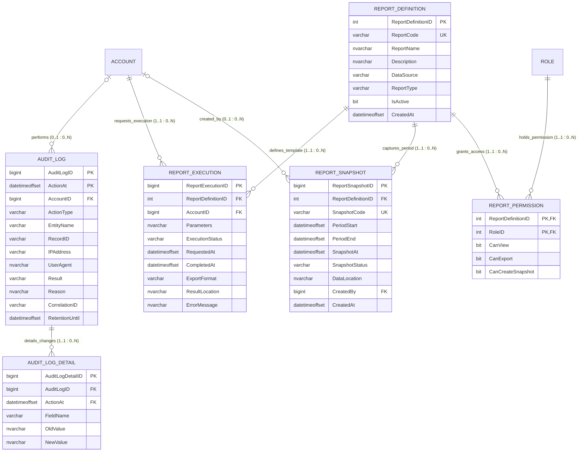

```mermaid
erDiagram
    ACCOUNT |o--o{ AUDIT_LOG : "performs (0..1 : 0..N)"
    AUDIT_LOG ||--o{ AUDIT_LOG_DETAIL : "details_changes (1..1 : 0..N)"

    REPORT_DEFINITION ||--o{ REPORT_EXECUTION : "defines_template (1..1 : 0..N)"
    ACCOUNT ||--o{ REPORT_EXECUTION : "requests_execution (1..1 : 0..N)"

    REPORT_DEFINITION ||--o{ REPORT_SNAPSHOT : "captures_period (1..1 : 0..N)"
    ACCOUNT |o--o{ REPORT_SNAPSHOT : "created_by (0..1 : 0..N)"

    REPORT_DEFINITION ||--o{ REPORT_PERMISSION : "grants_access (1..1 : 0..N)"
    ROLE ||--o{ REPORT_PERMISSION : "holds_permission (1..1 : 0..N)"

    AUDIT_LOG {
        bigint AuditLogID PK
        datetimeoffset ActionAt PK
        bigint AccountID FK
        varchar ActionType
        varchar EntityName
        varchar RecordID
        varchar IPAddress
        nvarchar UserAgent
        varchar Result
        nvarchar Reason
        varchar CorrelationID
        datetimeoffset RetentionUntil
    }
    AUDIT_LOG_DETAIL {
        bigint AuditLogDetailID PK
        bigint AuditLogID FK
        datetimeoffset ActionAt FK
        varchar FieldName
        nvarchar OldValue
        nvarchar NewValue
    }
    REPORT_DEFINITION {
        int ReportDefinitionID PK
        varchar ReportCode UK
        nvarchar ReportName
        nvarchar Description
        varchar DataSource
        varchar ReportType
        bit IsActive
        datetimeoffset CreatedAt
    }
    REPORT_EXECUTION {
        bigint ReportExecutionID PK
        int ReportDefinitionID FK
        bigint AccountID FK
        nvarchar Parameters
        varchar ExecutionStatus
        datetimeoffset RequestedAt
        datetimeoffset CompletedAt
        varchar ExportFormat
        nvarchar ResultLocation
        nvarchar ErrorMessage
    }
    REPORT_SNAPSHOT {
        bigint ReportSnapshotID PK
        int ReportDefinitionID FK
        varchar SnapshotCode UK
        datetimeoffset PeriodStart
        datetimeoffset PeriodEnd
        datetimeoffset SnapshotAt
        varchar SnapshotStatus
        nvarchar DataLocation
        bigint CreatedBy FK
        datetimeoffset CreatedAt
    }
    REPORT_PERMISSION {
        int ReportDefinitionID PK,FK
        int RoleID PK,FK
        bit CanView
        bit CanExport
        bit CanCreateSnapshot
    }
```
