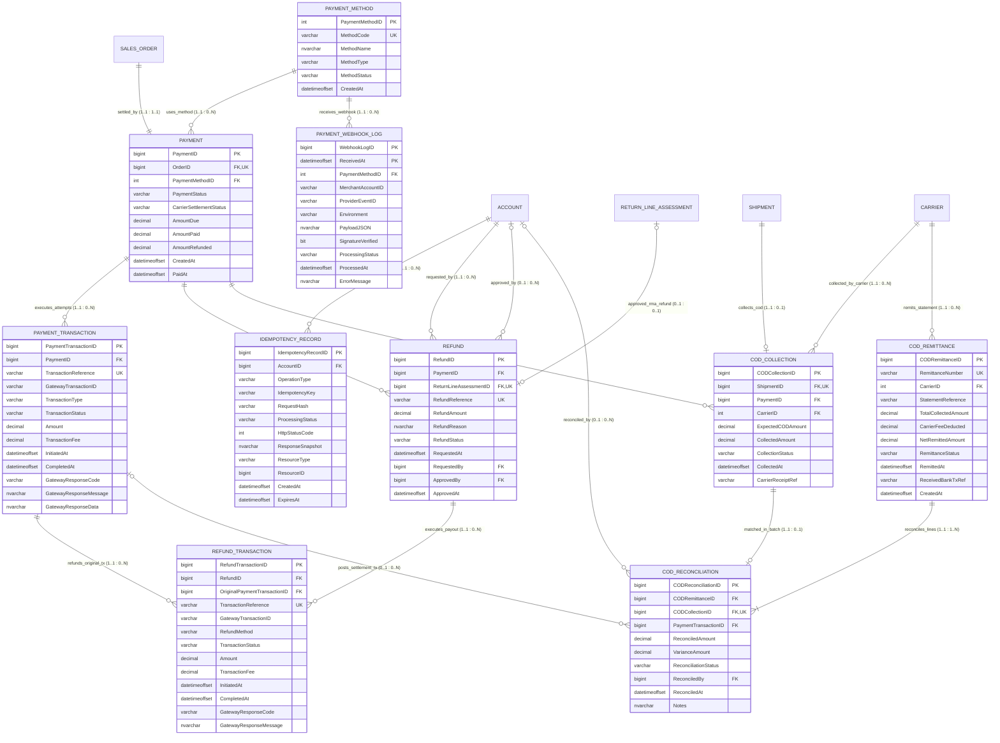

```mermaid
erDiagram
    SALES_ORDER ||--|| PAYMENT : "settled_by (1..1 : 1..1)"
    PAYMENT_METHOD ||--o{ PAYMENT : "uses_method (1..1 : 0..N)"
    PAYMENT_METHOD ||--o{ PAYMENT_WEBHOOK_LOG : "receives_webhook (1..1 : 0..N)"
    ACCOUNT ||--o{ IDEMPOTENCY_RECORD : "locks_idempotency (1..1 : 0..N)"
    ACCOUNT ||--o{ REFUND : "requested_by (1..1 : 0..N)"
    ACCOUNT |o--o{ REFUND : "approved_by (0..1 : 0..N)"
    ACCOUNT |o--o{ COD_RECONCILIATION : "reconciled_by (0..1 : 0..N)"

    PAYMENT ||--o{ PAYMENT_TRANSACTION : "executes_attempts (1..1 : 0..N)"
    PAYMENT ||--o{ REFUND : "has_refunds (1..1 : 0..N)"
    RETURN_LINE_ASSESSMENT |o--o| REFUND : "approved_rma_refund (0..1 : 0..1)"
    REFUND ||--o{ REFUND_TRANSACTION : "executes_payout (1..1 : 0..N)"
    PAYMENT_TRANSACTION ||--o{ REFUND_TRANSACTION : "refunds_original_tx (1..1 : 0..N)"

    SHIPMENT ||--o| COD_COLLECTION : "collects_cod (1..1 : 0..1)"
    PAYMENT ||--o{ COD_COLLECTION : "tracks_parcel_cod (1..1 : 0..N)"
    CARRIER ||--o{ COD_COLLECTION : "collected_by_carrier (1..1 : 0..N)"
    CARRIER ||--o{ COD_REMITTANCE : "remits_statement (1..1 : 0..N)"
    COD_REMITTANCE ||--|{ COD_RECONCILIATION : "reconciles_lines (1..1 : 1..N)"
    COD_COLLECTION ||--o| COD_RECONCILIATION : "matched_in_batch (1..1 : 0..1)"
    PAYMENT_TRANSACTION |o--o{ COD_RECONCILIATION : "posts_settlement_tx (0..1 : 0..N)"

    PAYMENT_METHOD {
        int PaymentMethodID PK
        varchar MethodCode UK
        nvarchar MethodName
        varchar MethodType
        varchar MethodStatus
        datetimeoffset CreatedAt
    }
    PAYMENT_WEBHOOK_LOG {
        bigint WebhookLogID PK
        datetimeoffset ReceivedAt PK
        int PaymentMethodID FK
        varchar MerchantAccountID
        varchar ProviderEventID
        varchar Environment
        nvarchar PayloadJSON
        bit SignatureVerified
        varchar ProcessingStatus
        datetimeoffset ProcessedAt
        nvarchar ErrorMessage
    }
    IDEMPOTENCY_RECORD {
        bigint IdempotencyRecordID PK
        bigint AccountID FK
        varchar OperationType
        varchar IdempotencyKey
        varchar RequestHash
        varchar ProcessingStatus
        int HttpStatusCode
        nvarchar ResponseSnapshot
        varchar ResourceType
        bigint ResourceID
        datetimeoffset CreatedAt
        datetimeoffset ExpiresAt
    }
    PAYMENT {
        bigint PaymentID PK
        bigint OrderID FK,UK
        int PaymentMethodID FK
        varchar PaymentStatus
        varchar CarrierSettlementStatus
        decimal AmountDue
        decimal AmountPaid
        decimal AmountRefunded
        datetimeoffset CreatedAt
        datetimeoffset PaidAt
    }
    PAYMENT_TRANSACTION {
        bigint PaymentTransactionID PK
        bigint PaymentID FK
        varchar TransactionReference UK
        varchar GatewayTransactionID
        varchar TransactionType
        varchar TransactionStatus
        decimal Amount
        decimal TransactionFee
        datetimeoffset InitiatedAt
        datetimeoffset CompletedAt
        varchar GatewayResponseCode
        nvarchar GatewayResponseMessage
        nvarchar GatewayResponseData
    }
    REFUND {
        bigint RefundID PK
        bigint PaymentID FK
        bigint ReturnLineAssessmentID FK,UK
        varchar RefundReference UK
        decimal RefundAmount
        nvarchar RefundReason
        varchar RefundStatus
        datetimeoffset RequestedAt
        bigint RequestedBy FK
        bigint ApprovedBy FK
        datetimeoffset ApprovedAt
    }
    REFUND_TRANSACTION {
        bigint RefundTransactionID PK
        bigint RefundID FK
        bigint OriginalPaymentTransactionID FK
        varchar TransactionReference UK
        varchar GatewayTransactionID
        varchar RefundMethod
        varchar TransactionStatus
        decimal Amount
        decimal TransactionFee
        datetimeoffset InitiatedAt
        datetimeoffset CompletedAt
        varchar GatewayResponseCode
        nvarchar GatewayResponseMessage
    }
    COD_COLLECTION {
        bigint CODCollectionID PK
        bigint ShipmentID FK,UK
        bigint PaymentID FK
        int CarrierID FK
        decimal ExpectedCODAmount
        decimal CollectedAmount
        varchar CollectionStatus
        datetimeoffset CollectedAt
        varchar CarrierReceiptRef
    }
    COD_REMITTANCE {
        bigint CODRemittanceID PK
        varchar RemittanceNumber UK
        int CarrierID FK
        varchar StatementReference
        decimal TotalCollectedAmount
        decimal CarrierFeeDeducted
        decimal NetRemittedAmount
        varchar RemittanceStatus
        datetimeoffset RemittedAt
        varchar ReceivedBankTxRef
        datetimeoffset CreatedAt
    }
    COD_RECONCILIATION {
        bigint CODReconciliationID PK
        bigint CODRemittanceID FK
        bigint CODCollectionID FK,UK
        bigint PaymentTransactionID FK
        decimal ReconciledAmount
        decimal VarianceAmount
        varchar ReconciliationStatus
        bigint ReconciledBy FK
        datetimeoffset ReconciledAt
        nvarchar Notes
    }
```
