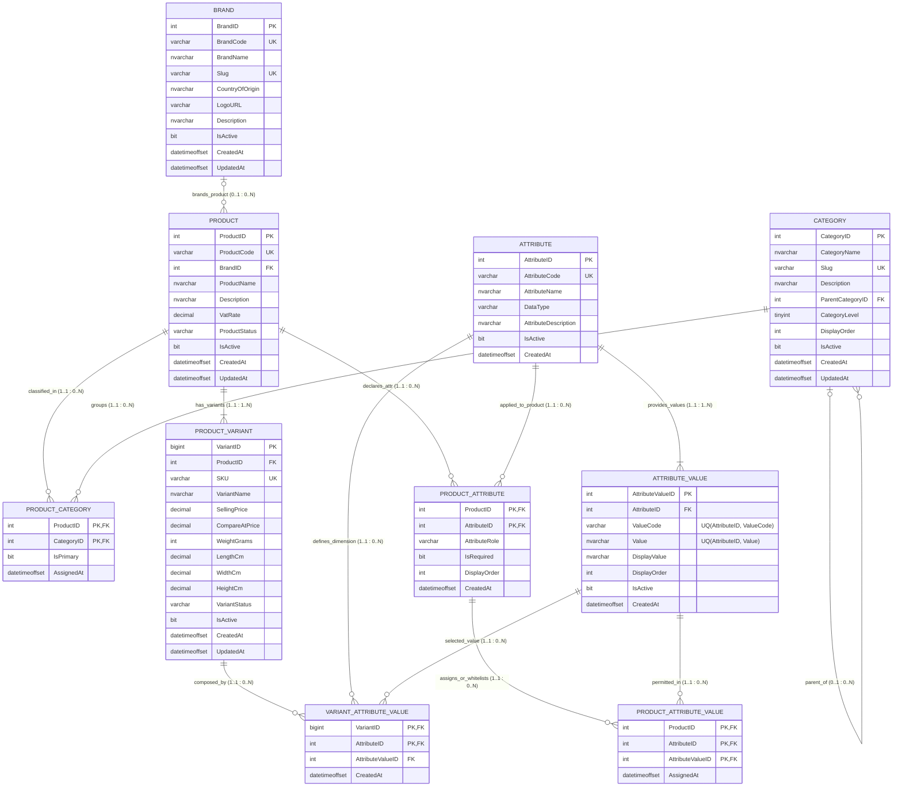

```mermaid
erDiagram
    BRAND |o--o{ PRODUCT : "brands_product (0..1 : 0..N)"
    PRODUCT ||--o{ PRODUCT_CATEGORY : "classified_in (1..1 : 0..N)"
    CATEGORY ||--o{ PRODUCT_CATEGORY : "groups (1..1 : 0..N)"
    CATEGORY |o--o{ CATEGORY : "parent_of (0..1 : 0..N)"

    PRODUCT ||--|{ PRODUCT_VARIANT : "has_variants (1..1 : 1..N)"

    PRODUCT ||--o{ PRODUCT_ATTRIBUTE : "declares_attr (1..1 : 0..N)"
    ATTRIBUTE ||--o{ PRODUCT_ATTRIBUTE : "applied_to_product (1..1 : 0..N)"

    ATTRIBUTE ||--|{ ATTRIBUTE_VALUE : "provides_values (1..1 : 1..N)"

    PRODUCT_ATTRIBUTE ||--o{ PRODUCT_ATTRIBUTE_VALUE : "assigns_or_whitelists (1..1 : 0..N)"
    ATTRIBUTE_VALUE ||--o{ PRODUCT_ATTRIBUTE_VALUE : "permitted_in (1..1 : 0..N)"

    PRODUCT_VARIANT ||--o{ VARIANT_ATTRIBUTE_VALUE : "composed_by (1..1 : 0..N)"
    ATTRIBUTE ||--o{ VARIANT_ATTRIBUTE_VALUE : "defines_dimension (1..1 : 0..N)"
    ATTRIBUTE_VALUE ||--o{ VARIANT_ATTRIBUTE_VALUE : "selected_value (1..1 : 0..N)"

    BRAND {
        int BrandID PK
        varchar BrandCode UK
        nvarchar BrandName
        varchar Slug UK
        nvarchar CountryOfOrigin
        varchar LogoURL
        nvarchar Description
        bit IsActive
        datetimeoffset CreatedAt
        datetimeoffset UpdatedAt
    }
    CATEGORY {
        int CategoryID PK
        nvarchar CategoryName
        varchar Slug UK
        nvarchar Description
        int ParentCategoryID FK
        tinyint CategoryLevel
        int DisplayOrder
        bit IsActive
        datetimeoffset CreatedAt
        datetimeoffset UpdatedAt
    }
    PRODUCT {
        int ProductID PK
        varchar ProductCode UK
        int BrandID FK
        nvarchar ProductName
        nvarchar Description
        decimal VatRate
        varchar ProductStatus
        bit IsActive
        datetimeoffset CreatedAt
        datetimeoffset UpdatedAt
    }
    PRODUCT_CATEGORY {
        int ProductID PK,FK
        int CategoryID PK,FK
        bit IsPrimary
        datetimeoffset AssignedAt
    }
    PRODUCT_VARIANT {
        bigint VariantID PK
        int ProductID FK
        varchar SKU UK
        nvarchar VariantName
        decimal SellingPrice
        decimal CompareAtPrice
        int WeightGrams
        decimal LengthCm
        decimal WidthCm
        decimal HeightCm
        varchar VariantStatus
        bit IsActive
        datetimeoffset CreatedAt
        datetimeoffset UpdatedAt
    }
    ATTRIBUTE {
        int AttributeID PK
        varchar AttributeCode UK
        nvarchar AttributeName
        varchar DataType
        nvarchar AttributeDescription
        bit IsActive
        datetimeoffset CreatedAt
    }
    ATTRIBUTE_VALUE {
        int AttributeValueID PK
        int AttributeID FK
        varchar ValueCode "UQ(AttributeID, ValueCode)"
        nvarchar Value "UQ(AttributeID, Value)"
        nvarchar DisplayValue
        int DisplayOrder
        bit IsActive
        datetimeoffset CreatedAt
    }
    PRODUCT_ATTRIBUTE {
        int ProductID PK,FK
        int AttributeID PK,FK
        varchar AttributeRole
        bit IsRequired
        int DisplayOrder
        datetimeoffset CreatedAt
    }
    PRODUCT_ATTRIBUTE_VALUE {
        int ProductID PK,FK
        int AttributeID PK,FK
        int AttributeValueID PK,FK
        datetimeoffset AssignedAt
    }
    VARIANT_ATTRIBUTE_VALUE {
        bigint VariantID PK,FK
        int AttributeID PK,FK
        int AttributeValueID FK
        datetimeoffset CreatedAt
    }
```
