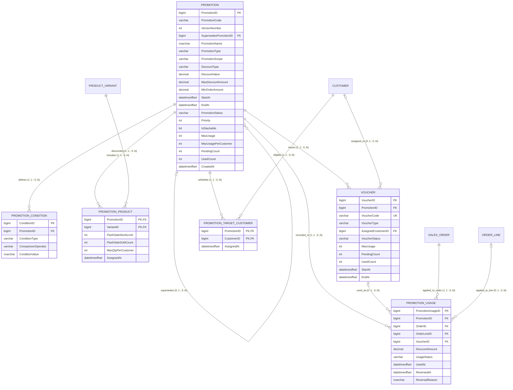

```mermaid
erDiagram
    PROMOTION |o--o{ PROMOTION : "supersedes (0..1 : 0..N)"
    PROMOTION ||--o{ PROMOTION_CONDITION : "defines (1..1 : 0..N)"
    PROMOTION ||--o{ PROMOTION_PRODUCT : "includes (1..1 : 0..N)"
    PRODUCT_VARIANT ||--o{ PROMOTION_PRODUCT : "discounted (1..1 : 0..N)"

    PROMOTION ||--o{ VOUCHER : "issues (1..1 : 0..N)"
    CUSTOMER |o--o{ VOUCHER : "assigned_to (0..1 : 0..N)"

    PROMOTION ||--o{ PROMOTION_TARGET_CUSTOMER : "whitelists (1..1 : 0..N)"
    CUSTOMER ||--o{ PROMOTION_TARGET_CUSTOMER : "eligible (1..1 : 0..N)"

    PROMOTION ||--o{ PROMOTION_USAGE : "recorded_in (1..1 : 0..N)"
    VOUCHER |o--o{ PROMOTION_USAGE : "used_as (0..1 : 0..N)"
    SALES_ORDER ||--o{ PROMOTION_USAGE : "applied_to_order (1..1 : 0..N)"
    ORDER_LINE |o--o{ PROMOTION_USAGE : "applied_to_line (0..1 : 0..N)"

    PROMOTION {
        bigint PromotionID PK
        varchar PromotionCode
        int VersionNumber
        bigint SupersedesPromotionID FK
        nvarchar PromotionName
        varchar PromotionType
        varchar PromotionScope
        varchar DiscountType
        decimal DiscountValue
        decimal MaxDiscountAmount
        decimal MinOrderAmount
        datetimeoffset StartAt
        datetimeoffset EndAt
        varchar PromotionStatus
        int Priority
        bit IsStackable
        int MaxUsage
        int MaxUsagePerCustomer
        int PendingCount
        int UsedCount
        datetimeoffset CreatedAt
    }
    PROMOTION_CONDITION {
        bigint ConditionID PK
        bigint PromotionID FK
        varchar ConditionType
        varchar ComparisonOperator
        nvarchar ConditionValue
    }
    PROMOTION_PRODUCT {
        bigint PromotionID PK,FK
        bigint VariantID PK,FK
        int FlashSaleStockLimit
        int FlashSaleSoldCount
        int MaxQtyPerCustomer
        datetimeoffset AssignedAt
    }
    VOUCHER {
        bigint VoucherID PK
        bigint PromotionID FK
        varchar VoucherCode UK
        varchar VoucherType
        bigint AssignedCustomerID FK
        varchar VoucherStatus
        int MaxUsage
        int PendingCount
        int UsedCount
        datetimeoffset StartAt
        datetimeoffset EndAt
    }
    PROMOTION_USAGE {
        bigint PromotionUsageID PK
        bigint PromotionID FK
        bigint OrderID FK
        bigint OrderLineID FK
        bigint VoucherID FK
        decimal DiscountAmount
        varchar UsageStatus
        datetimeoffset UsedAt
        datetimeoffset ReversedAt
        nvarchar ReversalReason
    }
    PROMOTION_TARGET_CUSTOMER {
        bigint PromotionID PK,FK
        bigint CustomerID PK,FK
        datetimeoffset AssignedAt
    }
```
