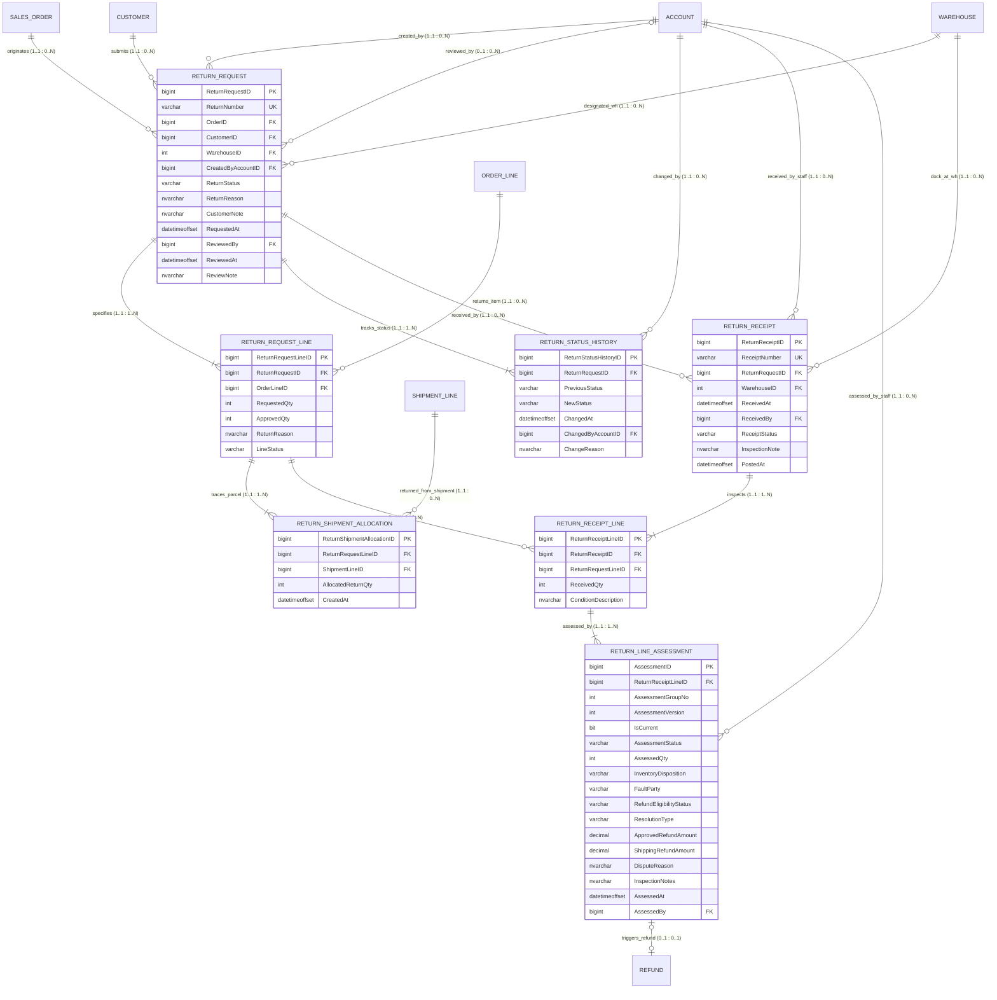

```mermaid
erDiagram
    SALES_ORDER ||--o{ RETURN_REQUEST : "originates (1..1 : 0..N)"
    CUSTOMER ||--o{ RETURN_REQUEST : "submits (1..1 : 0..N)"
    ACCOUNT ||--o{ RETURN_REQUEST : "created_by (1..1 : 0..N)"
    ACCOUNT |o--o{ RETURN_REQUEST : "reviewed_by (0..1 : 0..N)"
    WAREHOUSE ||--o{ RETURN_REQUEST : "designated_wh (1..1 : 0..N)"

    RETURN_REQUEST ||--|{ RETURN_REQUEST_LINE : "specifies (1..1 : 1..N)"
    ORDER_LINE ||--o{ RETURN_REQUEST_LINE : "returns_item (1..1 : 0..N)"

    RETURN_REQUEST_LINE ||--|{ RETURN_SHIPMENT_ALLOCATION : "traces_parcel (1..1 : 1..N)"
    SHIPMENT_LINE ||--o{ RETURN_SHIPMENT_ALLOCATION : "returned_from_shipment (1..1 : 0..N)"

    RETURN_REQUEST ||--|{ RETURN_STATUS_HISTORY : "tracks_status (1..1 : 1..N)"
    ACCOUNT ||--o{ RETURN_STATUS_HISTORY : "changed_by (1..1 : 0..N)"

    RETURN_REQUEST ||--o{ RETURN_RECEIPT : "received_by (1..1 : 0..N)"
    WAREHOUSE ||--o{ RETURN_RECEIPT : "dock_at_wh (1..1 : 0..N)"
    ACCOUNT ||--o{ RETURN_RECEIPT : "received_by_staff (1..1 : 0..N)"
    RETURN_RECEIPT ||--|{ RETURN_RECEIPT_LINE : "inspects (1..1 : 1..N)"
    RETURN_REQUEST_LINE ||--o{ RETURN_RECEIPT_LINE : "reconciles (1..1 : 0..N)"

    RETURN_RECEIPT_LINE ||--|{ RETURN_LINE_ASSESSMENT : "assessed_by (1..1 : 1..N)"
    ACCOUNT ||--o{ RETURN_LINE_ASSESSMENT : "assessed_by_staff (1..1 : 0..N)"
    RETURN_LINE_ASSESSMENT |o--o| REFUND : "triggers_refund (0..1 : 0..1)"

    RETURN_REQUEST {
        bigint ReturnRequestID PK
        varchar ReturnNumber UK
        bigint OrderID FK
        bigint CustomerID FK
        int WarehouseID FK
        bigint CreatedByAccountID FK
        varchar ReturnStatus
        nvarchar ReturnReason
        nvarchar CustomerNote
        datetimeoffset RequestedAt
        bigint ReviewedBy FK
        datetimeoffset ReviewedAt
        nvarchar ReviewNote
    }
    RETURN_REQUEST_LINE {
        bigint ReturnRequestLineID PK
        bigint ReturnRequestID FK
        bigint OrderLineID FK
        int RequestedQty
        int ApprovedQty
        nvarchar ReturnReason
        varchar LineStatus
    }
    RETURN_SHIPMENT_ALLOCATION {
        bigint ReturnShipmentAllocationID PK
        bigint ReturnRequestLineID FK
        bigint ShipmentLineID FK
        int AllocatedReturnQty
        datetimeoffset CreatedAt
    }
    RETURN_RECEIPT {
        bigint ReturnReceiptID PK
        varchar ReceiptNumber UK
        bigint ReturnRequestID FK
        int WarehouseID FK
        datetimeoffset ReceivedAt
        bigint ReceivedBy FK
        varchar ReceiptStatus
        nvarchar InspectionNote
        datetimeoffset PostedAt
    }
    RETURN_RECEIPT_LINE {
        bigint ReturnReceiptLineID PK
        bigint ReturnReceiptID FK
        bigint ReturnRequestLineID FK
        int ReceivedQty
        nvarchar ConditionDescription
    }
    RETURN_LINE_ASSESSMENT {
        bigint AssessmentID PK
        bigint ReturnReceiptLineID FK
        int AssessmentGroupNo
        int AssessmentVersion
        bit IsCurrent
        varchar AssessmentStatus
        int AssessedQty
        varchar InventoryDisposition
        varchar FaultParty
        varchar RefundEligibilityStatus
        varchar ResolutionType
        decimal ApprovedRefundAmount
        decimal ShippingRefundAmount
        nvarchar DisputeReason
        nvarchar InspectionNotes
        datetimeoffset AssessedAt
        bigint AssessedBy FK
    }
    RETURN_STATUS_HISTORY {
        bigint ReturnStatusHistoryID PK
        bigint ReturnRequestID FK
        varchar PreviousStatus
        varchar NewStatus
        datetimeoffset ChangedAt
        bigint ChangedByAccountID FK
        nvarchar ChangeReason
    }
```
