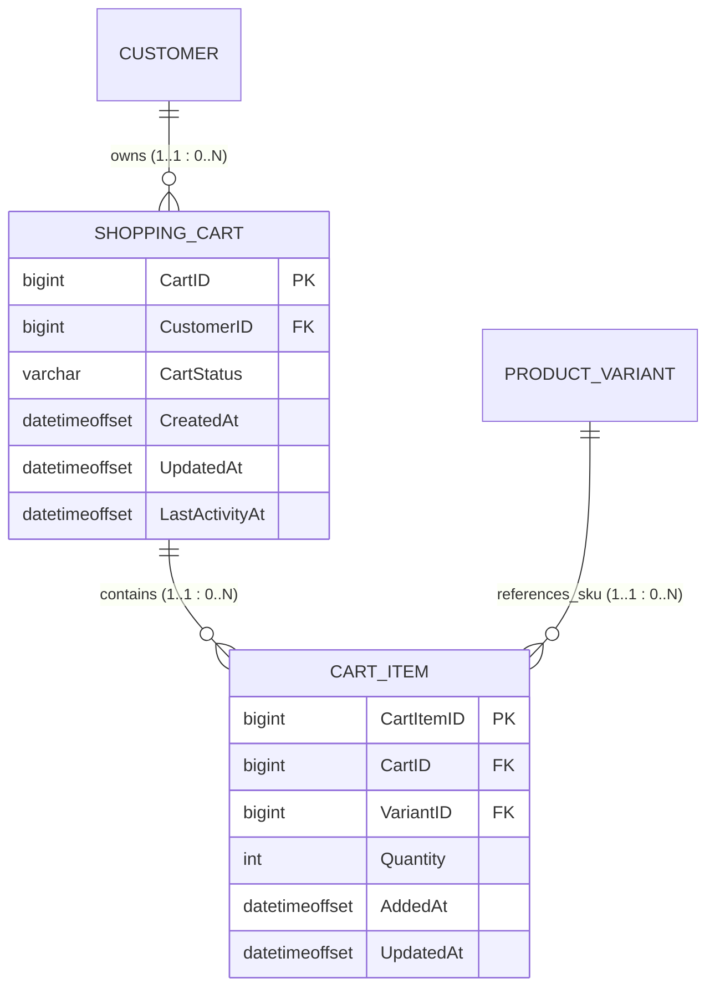

```mermaid
erDiagram
    CUSTOMER ||--o{ SHOPPING_CART : "owns (1..1 : 0..N)"
    SHOPPING_CART ||--o{ CART_ITEM : "contains (1..1 : 0..N)"
    PRODUCT_VARIANT ||--o{ CART_ITEM : "references_sku (1..1 : 0..N)"

    SHOPPING_CART {
        bigint CartID PK
        bigint CustomerID FK
        varchar CartStatus
        datetimeoffset CreatedAt
        datetimeoffset UpdatedAt
        datetimeoffset LastActivityAt
    }
    CART_ITEM {
        bigint CartItemID PK
        bigint CartID FK
        bigint VariantID FK
        int Quantity
        datetimeoffset AddedAt
        datetimeoffset UpdatedAt
    }
```
