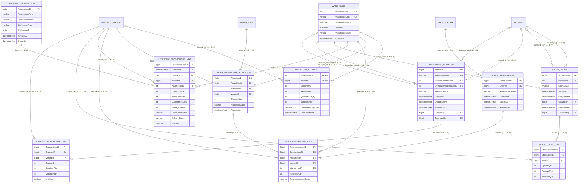

```mermaid
erDiagram
    WAREHOUSE ||--o{ INVENTORY_BALANCE : "tracks_stock (1..1 : 0..N)"
    PRODUCT_VARIANT ||--o{ INVENTORY_BALANCE : "stocked_as (1..1 : 0..N)"

    ORDER_LINE ||--|{ ORDER_WAREHOUSE_ALLOCATION : "splits_to (1..1 : 1..N)"
    WAREHOUSE ||--o{ ORDER_WAREHOUSE_ALLOCATION : "allocated_wh (1..1 : 0..N)"
    PRODUCT_VARIANT ||--o{ ORDER_WAREHOUSE_ALLOCATION : "allocated_item (1..1 : 0..N)"

    SALES_ORDER ||--o{ STOCK_RESERVATION : "reserves (1..1 : 0..N)"
    STOCK_RESERVATION ||--|{ STOCK_RESERVATION_LINE : "contains (1..1 : 1..N)"
    ORDER_WAREHOUSE_ALLOCATION ||--o{ STOCK_RESERVATION_LINE : "secures (1..1 : 0..N)"
    WAREHOUSE ||--o{ STOCK_RESERVATION_LINE : "reserved_at (1..1 : 0..N)"
    PRODUCT_VARIANT ||--o{ STOCK_RESERVATION_LINE : "held_sku (1..1 : 0..N)"

    INVENTORY_TRANSACTION ||--|{ INVENTORY_TRANSACTION_LINE : "logs (1..1 : 1..N)"
    WAREHOUSE ||--o{ INVENTORY_TRANSACTION_LINE : "locates (1..1 : 0..N)"
    PRODUCT_VARIANT ||--o{ INVENTORY_TRANSACTION_LINE : "affects_sku (1..1 : 0..N)"

    WAREHOUSE ||--o{ STOCK_COUNT : "audited_in (1..1 : 0..N)"
    ACCOUNT ||--o{ STOCK_COUNT : "created_by (1..1 : 0..N)"
    ACCOUNT |o--o{ STOCK_COUNT : "approved_by (0..1 : 0..N)"
    STOCK_COUNT ||--|{ STOCK_COUNT_LINE : "counts (1..1 : 1..N)"
    PRODUCT_VARIANT ||--o{ STOCK_COUNT_LINE : "counted_item (1..1 : 0..N)"

    WAREHOUSE ||--o{ WAREHOUSE_TRANSFER : "dispatches_transfer (1..1 : 0..N)"
    WAREHOUSE ||--o{ WAREHOUSE_TRANSFER : "receives_transfer (1..1 : 0..N)"
    ACCOUNT ||--o{ WAREHOUSE_TRANSFER : "created_by (1..1 : 0..N)"
    ACCOUNT |o--o{ WAREHOUSE_TRANSFER : "approved_by (0..1 : 0..N)"
    WAREHOUSE_TRANSFER ||--|{ WAREHOUSE_TRANSFER_LINE : "transfers (1..1 : 1..N)"
    PRODUCT_VARIANT ||--o{ WAREHOUSE_TRANSFER_LINE : "transferred_item (1..1 : 0..N)"

    WAREHOUSE {
        int WarehouseID PK
        varchar WarehouseCode UK
        nvarchar WarehouseName
        nvarchar Address
        varchar WarehouseStatus
        datetimeoffset CreatedAt
    }
    INVENTORY_BALANCE {
        int WarehouseID PK,FK
        bigint VariantID PK,FK
        int OnHandQty
        int ReservedQty
        int QuarantinedQty
        int DamagedQty
        decimal CurrentAverageCost
        datetimeoffset LastUpdatedAt
    }
    ORDER_WAREHOUSE_ALLOCATION {
        bigint AllocationID PK
        bigint OrderLineID FK
        int WarehouseID FK
        bigint VariantID FK
        int AllocatedQty
        varchar AllocationStatus
        datetimeoffset AllocatedAt
    }
    STOCK_RESERVATION {
        bigint ReservationID PK
        bigint OrderID FK
        varchar ReservationStatus
        datetimeoffset CreatedAt
        datetimeoffset ExpiresAt
        datetimeoffset ReleasedAt
    }
    STOCK_RESERVATION_LINE {
        bigint ReservationLineID PK
        bigint ReservationID FK
        bigint AllocationID FK
        bigint VariantID FK
        int WarehouseID FK
        int ReservedQty
        varchar ReservationLineStatus
    }
    INVENTORY_TRANSACTION {
        bigint TransactionID PK
        varchar TransactionType
        varchar TransactionStatus
        varchar ReferenceType
        bigint ReferenceID
        datetimeoffset CreatedAt
        datetimeoffset PostedAt
    }
    INVENTORY_TRANSACTION_LINE {
        bigint TransactionLineID PK
        datetimeoffset CreatedAt PK
        bigint TransactionID FK
        bigint VariantID FK
        int WarehouseID FK
        int OnHandDelta
        int ReservedDelta
        int QuarantinedDelta
        int DamagedDelta
        varchar FromStockStatus
        varchar ToStockStatus
        decimal UnitCost
    }
    STOCK_COUNT {
        bigint StockCountID PK
        int WarehouseID FK
        varchar CountStatus
        datetimeoffset StartedAt
        datetimeoffset CompletedAt
        bigint CreatedBy FK
        datetimeoffset ApprovedAt
        bigint ApprovedBy FK
    }
    STOCK_COUNT_LINE {
        bigint StockCountLineID PK
        bigint StockCountID FK
        bigint VariantID FK
        int SystemQty
        int CountedQty
        int VarianceQty
    }
    WAREHOUSE_TRANSFER {
        bigint TransferID PK
        varchar TransferNumber UK
        int SourceWarehouseID FK
        int DestinationWarehouseID FK
        varchar TransferStatus
        datetimeoffset CreatedAt
        datetimeoffset DispatchedAt
        datetimeoffset ReceivedAt
        bigint CreatedBy FK
        bigint ApprovedBy FK
    }
    WAREHOUSE_TRANSFER_LINE {
        bigint TransferLineID PK
        bigint TransferID FK
        bigint VariantID FK
        int TransferQty
        int ReceivedQty
        int VarianceQty
        decimal UnitCost
    }
```
